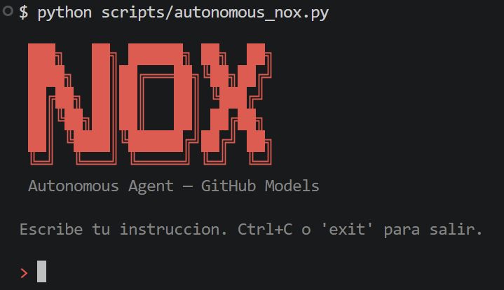

# NOX - Custom Voice Assistant

Proyecto de ML para clasificacion de intenciones de voz. NOX entiende lenguaje natural, enruta intents con reglas robustas y ejecuta acciones reales en Windows.



## Estado actual

| Modelo | Intents | Accuracy |
|--------|---------|----------|
| v1 (LogReg baseline) | 19 | 0.7083 |
| v2 (LinearSVC) | 19 | 0.7917 |
| v3 (LinearSVC + balanced) | 21 | 0.7059 |
| nox100_best | 103 | 0.9995 avg (20 runs) |
| **nox250_best** | **250** | **0.9993 avg (20 runs)** |

El modelo `nox250_best` fue entrenado en 20 iteraciones con distintas semillas. Accuracy minima: 0.9960, maxima: 1.0000.

## Fases del proyecto

| Fase | Estado | Descripcion |
|------|--------|-------------|
| Fase 1: Clasificacion de intenciones | ✅ Completa | TF-IDF + LinearSVC, 250 intents funcionales |
| Fase 2: Extraccion de entidades | ✅ Completa | Extraccion de hora, porcentaje, temperatura, contacto, ciudad, query |
| Fase 3: Sistema de acciones | ✅ Funcional local | Ejecucion real local en Windows con modos gamer/dev/foco |
| Fase 4: LLMOps | 🔲 Pendiente | Fine-tuning, PromptFlow, monitoreo |

## Estructura del proyecto

```
├── src/                          # Modulos core (importables)
│   ├── data_pipeline.py          # Limpieza y split train/test
│   ├── model.py                  # Build y entrenamiento de pipelines
│   ├── evaluate.py               # Metricas: accuracy, reporte, confusion matrix
│   ├── predict.py                # Prediccion de intenciones
│   ├── intent_router.py          # Reglas de enrutamiento y normalizacion
│   ├── entity_extractor.py       # Extraccion de entidades
│   └── action_executor.py        # Ejecucion de acciones locales
│
├── scripts/                      # Scripts ejecutables
│   ├── run_phase1.py             # Automatizacion completa Fase 1
│   ├── chat_nox.py               # Consola interactiva con NOX
│   ├── nox_control_panel.py      # Interfaz desktop estilo Jarvis
│   ├── apply_feedback.py         # Incorpora feedback al dataset
│   ├── generate_nox_100_dataset.py   # Genera dataset NOX100
│   ├── generate_nox_250_dataset.py   # Genera dataset NOX250
│   ├── train_nox100_iterative.py     # Entrenamiento iterativo NOX100
│   └── train_nox250_iterative.py     # Entrenamiento iterativo NOX250
│
├── data/
│   ├── raw/
│   │   ├── intent_dataset.csv
│   │   ├── nox_100_intents_catalog.csv
│   │   ├── nox_100_intents_dataset.csv
│   │   ├── nox_250_intents_catalog.csv
│   │   ├── nox_250_intents_dataset.csv
│   │   └── nox_feedback.csv
│   ├── processed/
│   └── train_test/
│
├── models/
│   ├── intent_model_nox100_best.joblib
│   └── intent_model_nox250_best.joblib
│
├── results/
│   ├── nox100_iterative_results.csv
│   └── nox250_iterative_results.csv
│
├── requirements.txt
└── README.md
```

## Setup

```bash
cd custom-voice-assistant
# Recomendado: Python 3.11 o 3.12 (evita fallos binarios en voz/ML)
python -m venv .venv
source .venv/Scripts/activate
pip install -r requirements.txt
```

### Seguridad de secretos

```bash
cp .env.example .env
```

- Configura `GITHUB_TOKEN` solo en `.env` local.
- `.env` ya esta excluido por `.gitignore`.
- Si alguna vez expusiste un token, revocalo y genera uno nuevo.

## Uso

### Interfaz desktop estilo Jarvis (recomendada)

```bash
python scripts/nox_control_panel.py
```

Opciones:

```bash
python scripts/nox_control_panel.py --no-execute
python scripts/nox_control_panel.py --no-feedback
python scripts/nox_control_panel.py --version nox250
```

La interfaz incluye:
- Botones de acciones rapidas para trabajo, gaming y anti-procrastinacion.
- Panel superior con traza del pipeline (texto -> intent -> entidades -> resultado).
- Consola fija con entrada manual libre.
- Captura de feedback integrada para corregir intents en tiempo real.

### Consola interactiva

```bash
python scripts/chat_nox.py --version nox250
```

### Autonomous Agent (GitHub Models + Ollama)

```bash
python scripts/autonomous_nox.py
python scripts/autonomous_nox.py --voice
python scripts/autonomous_nox.py --auto-confirm
```

Personalidad y voz (Jarvis-like):

```bash
# .env
NOX_PERSONA_MODE=jarvis_sarcastic
NOX_ENABLE_JOKES=true
NOX_TTS_RATE=182
NOX_TTS_VOLUME=1.0
NOX_TTS_VOICE_HINT=spanish
```

Notas de seguridad:
- `--auto-confirm` no ejecuta acciones de riesgo alto/critico.
- El agente valida y sanitiza entrada de usuario antes de planificar tools.

### Validacion rapida (smoke)

```bash
python scripts/test_entities.py
python scripts/test_intent_router.py
pytest tests -q
```

### Flujo de feedback y retrain

```bash
python scripts/apply_feedback.py --target nox250
python scripts/train_nox250_iterative.py
```

Aprendizaje continuo asistido por logs:

```bash
python scripts/nox_train_continuous.py --max-items 400
```

Servicio de escritorio (voz en background):

```bash
python scripts/nox_desktop_service.py --run
python scripts/nox_desktop_service.py --install-startup
python scripts/nox_desktop_service.py --remove-startup
```

Logs del servicio y TTS:
- Consola: `[SERVICE][WAKE]`, `[SERVICE][PARTIAL]`, `[SERVICE][VOICE]`, `[SERVICE][IA_FULL]`, `[SERVICE][LISTENING]`.
- Archivo general: `results/autonomous_agent_logs.jsonl` (eventos `service_*`).
- Archivo TTS: `results/voice_tts_logs.jsonl` (texto hablado y errores de voz).

Caso de uso inteligente gaming (ejemplo):
- "Quiero jugar al God of War"
- NOX intenta encontrarlo en bibliotecas Steam y abrirlo.
- Si no esta instalado, abre la busqueda en Steam Store y devuelve la accion sugerida para instalar.

### Regenerar NOX250 desde cero

```bash
python scripts/generate_nox_250_dataset.py
python scripts/train_nox250_iterative.py
```

## Nox personalidad

NOX prioriza acciones utiles para un perfil ingeniero de software gamer/procrastinador:
- Modo foco: ajusta entorno para programar.
- Modo gaming: prepara Steam/Discord y perfil multimedia.
- Atajos rapidos para video, timers Pomodoro, estado del sistema y productividad diaria.

## Tecnologia usada

- scikit-learn: TfidfVectorizer + LinearSVC pipeline
- joblib: serializacion de modelos
- pandas / numpy: manejo de datos
- opencv-python: foto desde camara
- Pillow: captura de pantalla
- Python 3.11/3.12 (recomendado)

## Troubleshooting rapido

- Error de voz `No module named '_cffi_backend'`:
	- Reinstalar `cffi`: `pip install --force-reinstall cffi`
- Fallos instalando dependencias en Python 3.14:
	- Usa Python 3.11 o 3.12 para este proyecto.
- Vosk no escucha:
	- `python scripts/setup_vosk_es.py`
	- `python scripts/test_vosk_microphone.py`
